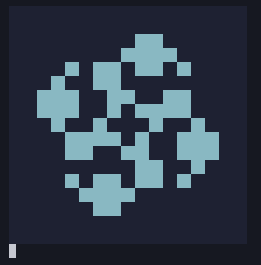

# Life-on-Verilog-Simulator

Icarus Verilog **Simulator** で動くライフゲームです。

macOSのTermialで動作することを確認しています。



## 実行

```sh
# コンパイル
iverilog -s main life.v

# 実行
vvp a.out

# 初期配置を与えて実行
vvp a.out +i=ファイル名
```

## 初期配置ファイル

| 名前 | 説明 |
| --- | --- |
| in/galaxy.txt | [銀河](https://ja.wikipedia.org/wiki/%E9%8A%80%E6%B2%B3_(%E3%83%A9%E3%82%A4%E3%83%95%E3%82%B2%E3%83%BC%E3%83%A0)) |
| in/glider.txt | [グライダー](https://ja.wikipedia.org/wiki/%E3%82%B0%E3%83%A9%E3%82%A4%E3%83%80%E3%83%BC_(%E3%83%A9%E3%82%A4%E3%83%95%E3%82%B2%E3%83%BC%E3%83%A0)) |
| in/gun.txt | [グライダー銃](https://ja.wikipedia.org/wiki/%E3%82%B0%E3%83%A9%E3%82%A4%E3%83%80%E3%83%BC%E9%8A%83) |
| in/spaceship.txt | [宇宙船](https://ja.wikipedia.org/wiki/%E5%AE%87%E5%AE%99%E8%88%B9_(%E3%83%A9%E3%82%A4%E3%83%95%E3%82%B2%E3%83%BC%E3%83%A0)) |

gun.txtを読み込ませる際は`life.v`の冒頭で定義されているマクロを次のように変更してください。
- `WIDTH`を36に
- `HEIGHT`を14に
- `TORUS`を削除